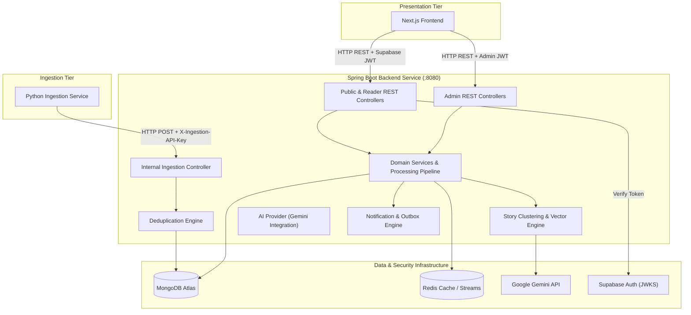

# Sri Lankan Multilingual News Intelligence Platform

A full-stack multilingual news intelligence platform for Sri Lankan news that collects reports from multiple publishers, processes and enriches them, groups related publisher reports into real-world Story clusters, supports English/Sinhala/Tamil experiences, and provides search, reporting-activity trending, coverage comparison, timelines, grounded Story Q&A, personalization, notifications, privacy-conscious analytics, and operational administration.

The system is composed of three independently maintained services:

- **Next.js Frontend** — reader, account, personalization, and admin experiences
- **Spring Boot Backend** — APIs, persistence, processing, Story intelligence, search, AI orchestration, authentication, notifications, and analytics
- **Python Ingestion Service** — publisher discovery, extraction, and scheduled ingestion

---

## Backend Repository

This repository contains the core Spring Boot application (`lk.srilankannews`), serving as the central orchestration, persistence, domain logic, search, AI integration, and security layer for the entire Sri Lankan Multilingual News Intelligence Platform.

---

## Table of Contents

- [Responsibilities](#responsibilities)
- [Technology Stack](#technology-stack)
- [Backend Architecture Diagram](#backend-architecture-diagram)
- [Domain Model](#domain-model)
- [Article Lifecycle](#article-lifecycle)
- [Deduplication](#deduplication)
- [Story Clustering & Vector Intelligence](#story-clustering--vector-intelligence)
- [AI Architecture](#ai-architecture)
- [Search & Trending Engine](#search--trending-engine)
- [Authentication & Authorization](#authentication--authorization)
- [Notifications Architecture](#notifications-architecture)
- [Analytics & Privacy System](#analytics--privacy-system)
- [Redis Usage & Streaming](#redis-usage--streaming)
- [MongoDB Collections](#mongodb-collections)
- [API Overview](#api-overview)
- [Environment Configuration](#environment-configuration)
- [Running Locally](#running-locally)
- [Testing & Quality Verification](#testing--quality-verification)
- [Project Structure](#project-structure)
- [Copyright & Content Safety](#copyright--content-safety)
- [Related Repositories](#related-repositories)

---

## Responsibilities

- **Public REST APIs**: Serves reader discovery feeds, story clusters, searches, timelines, and article attribution.
- **Internal Ingestion API**: Validates and ingests normalized article payloads from the Python ingestion service using API Key authentication.
- **Deduplication & Persistence**: Enforces canonical URL hashing and title similarity checks to prevent duplicate article ingestion into MongoDB.
- **Story Intelligence & Clustering**: Groups multi-publisher articles into cohesive Story clusters using hybrid lexical matching and Gemini vector embeddings.
- **AI Orchestration**: Manages Gemini API integrations for neutral executive story summaries, multi-publisher coverage comparisons, timelines, grounded Story Q&A, and translations.
- **Personalization & Accounts**: Tracks bookmarks, source follows, topic follows, and personalized "For You" recommendations.
- **Notifications Engine**: Manages in-app alerts, Redis stream dispatching, outbox patterns, and signed email unsubscriptions.
- **Privacy-Conscious Analytics**: Collects pseudonymous engagement metrics, performs rollups, and respects DNT/GPC privacy signals.
- **Admin Management APIs**: Powers ingestion health monitoring, processing queue inspection, AI operational metrics, audit logging, and user stats.

---

## Technology Stack

- **Framework**: Spring Boot `3.5.16` (Java `17`)
- **Web & Security**: Spring Web, Spring Security, Spring OAuth2 Resource Server (JWT verification)
- **Database**: MongoDB Atlas (`spring-boot-starter-data-mongodb`)
- **Cache & Messaging**: Redis / Valkey (`spring-boot-starter-data-redis`)
- **AI SDK**: Google GenAI Java SDK (`com.google.genai:google-genai` `1.68.0`)
- **Email**: Spring Starter Mail (`spring-boot-starter-mail`)
- **Monitoring**: Spring Actuator (`spring-boot-starter-actuator`)
- **Build Tool**: Apache Maven (`3.9+`)

---

## Backend Architecture Diagram



---

## Domain Model

Key MongoDB documents and domain models in `lk.srilankannews`:

- **Source** (`Source`): Represents a publisher entity (e.g., Daily Mirror, NewsFirst, Hiru News) including URL, slug, language, and operational status.
- **Article** (`Article`): Single report published by a news source. Contains canonical URL, title, snippet, body content (internal), publication timestamp, source attribution, and vector embedding.
- **Story** (`Story`): Grouped real-world event cluster containing references to multiple publisher Articles, AI-generated summary, timeline, and coverage comparison matrix.
- **UserProfile** (`UserProfile`): Reader account preferences, display language choices, and category preferences mapped to Supabase sub.
- **Bookmark** (`Bookmark`): M:N relationship tracking saved user articles.
- **Follow** (`Follow`): M:N relationship tracking source and topic subscriptions.
- **Notification** (`Notification`): User alert record for story updates, system announcements, and delivery preferences.
- **AnalyticsEvent** / **AnalyticsDailyMetric**: Pseudonymous reader event logs and daily aggregate engagement rollups.
- **AdminAuditEvent**: Append-only log tracking administrative operations and configuration overrides.

---

## Article Lifecycle

1. **Ingestion Request**: Python service POSTs extracted article DTO to `/api/v1/internal/ingestion/articles`.
2. **Key Verification**: Backend validates `X-Ingestion-API-Key`.
3. **Deduplication**: Checks canonical URL hash and exact title duplication in MongoDB.
4. **Persistence**: Saves raw article payload to MongoDB `articles` collection.
5. **Async Enrichment**: Enqueues processing task for language verification, keyword extraction, and vector embedding generation via Gemini API.
6. **Story Clustering**: Evaluates temporal window (default 48h) and cosine vector similarity against existing active Stories. Assigns article to existing Story or spawns a new Story cluster.
7. **Public Indexing**: Exposes updated Article and Story intelligence to frontend REST APIs.

---

## Deduplication

The backend guarantees single-ingestion invariants through:
- **Canonical URL Hashing**: Strips tracking parameters (`utm_*`, `ref`, session IDs) and normalizes protocols/trailing slashes before computing a deterministic hash.
- **Unique Database Indexes**: MongoDB index on `canonicalUrl` prevents duplicate storage.
- **Title Fingerprinting**: Near-duplicate window matching within recent publisher submissions.

---

## Story Clustering & Vector Intelligence

- **Lexical Matching**: Initial candidate selection filters articles within a configurable temporal window (`STORY_CLUSTER_WINDOW_HOURS`, default 48h) sharing key entities and topic tags.
- **Vector Embeddings**: Generates 784/768-dimensional dense vector embeddings using Google Gemini (`gemini-embedding-2`).
- **Cosine Similarity Matching**: Evaluates semantic similarity scores against candidate Story vectors using thresholding (`STORY_SEMANTIC_THRESHOLD`, default 0.82; cross-language threshold 0.90).
- **Cluster Evolution**: Dynamically updates Story topic tags, cover media, and time boundaries as new publisher reports arrive.

---

## AI Architecture

The `lk.srilankannews.ai` package encapsulates all generative AI operations via Google Gemini:

- `AiProvider`: Interface for text generation, story summarization, timeline extraction, coverage comparison, and grounded Q&A.
- `EmbeddingProvider`: Interface for generating vector representations of text snippets.
- `GroundedAnswerProvider`: Evaluates user questions against retrieved Story article context (`Ask This Story`).
- `GeminiFailureMapper`: Intercepts API rate limits, quota limits, and timeouts to ensure fallback safety without breaking core reading workflows.

---

## Search & Trending Engine

### Search Architecture
- **Keyword Search**: Uses MongoDB text indexing across article titles, snippets, and topic keywords.
- **Semantic Search**: Uses Atlas Vector Search (`idx_articles_semantic_vector`) to find articles matching the semantic meaning of search queries.

### Trending Architecture
- **Activity-Based Ranking**: Ranks stories by calculating publisher reporting volume, multi-source diversity, and time decay using a 12-hour half-life exponential decay formula (`TRENDING_RECENCY_HALF_LIFE_HOURS`).
- **No Manipulation**: Does not use raw clicks, viral metrics, or user activity tracking to determine trending topics.

---

## Authentication & Authorization

- **Supabase Integration**: Spring Security validates incoming `Authorization: Bearer <JWT>` tokens using Supabase's public JWKS endpoint (`SUPABASE_AUTH_JWKS_URI`).
- **Role Authority**: Compares validated JWT subject (`sub`) against configured `ADMIN_USER_IDS` to grant `ROLE_ADMIN` permissions.
- **Zero Raw Input Trust**: All user actions (`/me`, bookmarks, follows) derive the user identity strictly from the verified JWT token claims.

---

## Notifications Architecture

- **Mongo Outbox Pattern**: Persists pending notifications atomically alongside state changes.
- **Redis Streams**: Dispatches notification events asynchronously to background consumers.
- **Preference Verification**: Filters notifications against user quiet hours, timezone settings, and topic choices before dispatching.
- **Email Unsubscribe Security**: Issues cryptographic signatures on email unsubscription URLs, allowing users to safely opt-out without authentication.

---

## Analytics & Privacy System

- **Pseudonymous Collection**: Hashes user identifiers using a rotating daily salt.
- **Data Scrubbing**: Strips raw search query strings, user email addresses, notification bodies, and Ask Q&A text.
- **Runtime Suppression**: Checks reader request headers for `DNT: 1` or `Sec-GPC: 1` and suppresses event recording.
- **Daily Rollups**: Automatically aggregates events into `AnalyticsDailyMetric` collections for admin reporting.

---

## Redis Usage & Streaming

Redis / Valkey handles transient state:
- **`article-discovered` / Notification Streams**: Asynchronous event streams for decoupling background ingestion processing.
- **Public Feed Caching**: Short-lived TTL caching for public discovery endpoints.
- **Rate Limiting**: Protects grounded Q&A (`/ask`) endpoints from abuse.

---

## MongoDB Collections

- `sources` — Registered publisher specifications and health metrics
- `articles` — Extracted news articles and vector embeddings
- `stories` — Clustered stories, AI summaries, timelines, and comparisons
- `user_profiles` — Reader settings, language choices, and preferences
- `bookmarks` — User saved article references
- `follows` — Followed publisher sources and topic tags
- `notifications` — In-app notification history
- `analytics_events` — Raw pseudonymous telemetry events (with TTL index)
- `analytics_daily_metrics` — Aggregate daily engagement statistics
- `admin_audit_events` — Append-only administrative operation logs

---

## API Overview

### Public & Reader APIs
- `GET /api/v1/articles` — Paginated article feed
- `GET /api/v1/articles/{id}` — Article detail by ID
- `GET /api/v1/stories` — Clustered Story index
- `GET /api/v1/stories/{id}` — Story detail, summary, and coverage comparison
- `GET /api/v1/stories/{id}/timeline` — Chronological event timeline
- `POST /api/v1/stories/{id}/ask` — Grounded Story Q&A
- `GET /api/v1/trending` — Publisher activity trending stories
- `GET /api/v1/search` — Keyword and semantic search
- `GET /api/v1/sources` — Publisher source registry

### Authenticated User APIs (`/me`)
- `GET/PUT /api/v1/me/profile` — Reader profile & preferences
- `GET/POST/DELETE /api/v1/me/bookmarks` — Saved articles
- `GET/POST/DELETE /api/v1/me/follows` — Source & topic subscriptions
- `GET /api/v1/me/notifications` — Notification feed
- `GET /api/v1/me/for-you` — Personalized story recommendations

### Internal Ingestion API (Protected)
- `POST /api/v1/internal/ingestion/articles` — Submit extracted article (Requires `X-Ingestion-API-Key`)

### Admin Operational APIs (Requires `ROLE_ADMIN`)
- `GET /api/v1/admin/overview` — System operational dashboard
- `GET/PUT /api/v1/admin/ingestion/settings` — Ingestion settings & scheduler controls
- `GET /api/v1/admin/processing/queue` — Processing queue & DLQ status
- `GET /api/v1/admin/ai/overview` — Gemini AI metrics & provider latency
- `GET /api/v1/admin/audit/logs` — Security audit logs
- `GET /api/v1/admin/analytics/summary` — Aggregate analytics reports

---

## Environment Configuration

Configure `.env` or application environment using variables from `.env.example`:

| Environment Variable | Purpose |
|---|---|
| `MONGODB_URI` | MongoDB Atlas connection string |
| `REDIS_URL` | Redis / Valkey connection URL |
| `INGESTION_API_KEY` | Shared secret key for internal ingestion API |
| `SUPABASE_AUTH_ISSUER` | Supabase Auth issuer URL |
| `SUPABASE_AUTH_JWKS_URI` | Supabase public JWKS endpoint |
| `SUPABASE_AUTH_AUDIENCE` | Expected JWT audience (`authenticated`) |
| `ADMIN_USER_IDS` | Comma-separated Supabase `sub` strings granted Admin role |
| `GEMINI_API_KEY` | Google Gemini API key for AI summarization & embeddings |
| `GEMINI_MODEL` | Gemini model ID (e.g., `gemini-2.5-flash`) |
| `MULTILINGUAL_MODEL` | Gemini model ID for translation tasks |

> **Security Alert**: Never commit secret keys, MongoDB credentials, or actual admin user IDs.

---

## Running Locally

### Prerequisites
- JDK 17
- Maven 3.9+
- MongoDB instance (local or Atlas)
- Redis instance

### Build & Run
```bash
# Clone backend repository
git clone https://github.com/dulanprabashwara/sri-lanka-news-backend.git
cd sri-lanka-news-backend

# Compile project
mvn clean compile

# Run Spring Boot application
mvn spring-boot:run
```
The backend server will start on port `8080`.

---

## Testing & Quality Verification

```bash
# Compile and verify test classes
mvn test-compile

# Run unit and integration tests
mvn test

# Build executable JAR package
mvn package
```

---

## Project Structure

```
sri-lanka-news-backend/
├── src/
│   ├── main/
│   │   ├── java/lk/srilankannews/
│   │   │   ├── admin/           # Admin operational controllers & audit logging
│   │   │   ├── ai/              # Google Gemini AI provider & embedding integration
│   │   │   ├── analytics/       # Pseudonymous engagement collection & rollups
│   │   │   ├── articles/        # Article domain models & persistence
│   │   │   ├── bookmarks/       # Reader bookmark management
│   │   │   ├── follows/         # Source & topic subscription management
│   │   │   ├── foryou/          # Recommendation engine
│   │   │   ├── ingestion/       # Internal ingestion controller & validation
│   │   │   ├── notifications/   # In-app alerts, email outbox & unsubscriptions
│   │   │   ├── search/          # Keyword & Atlas Vector search controllers
│   │   │   ├── sources/         # Publisher source models & registry
│   │   │   ├── stories/         # Story clustering, timeline & grounded Q&A
│   │   │   ├── trending/        # Reporting activity ranking engine
│   │   │   └── SriLankaNewsApplication.java # Main application entrypoint
│   │   └── resources/
│   │       └── application.yml  # Application properties & profile setup
│   └── test/                    # JUnit 5 & Spring Boot test suite
└── pom.xml                      # Maven dependencies & build configuration
```

---

## Copyright & Content Safety

- The platform respects publisher intellectual property rights.
- Full extracted article bodies are stored internally for NLP analysis, clustering, and summarization only.
- The public API exposes neutral summaries, topic tags, and source metadata, always linking directly to the original publisher's website for full article consumption.

---

## Related Repositories

| Repository | Description |
|---|---|
| [sri-lanka-news-frontend](https://github.com/dulanprabashwara/sri-lanka-news-frontend) | Next.js 16 App Router presentation layer |
| [sri-lanka-news-ingestion](https://github.com/dulanprabashwara/sri-lanka-news-ingestion) | Python 3.12 scheduled publisher extraction & ingestion service |
